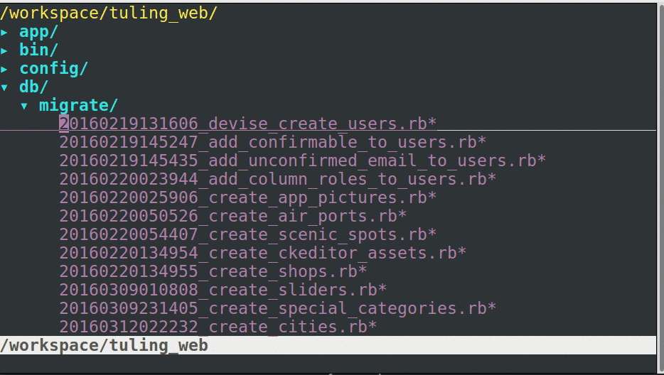

# 数据库迁移

migration, 是 DB migration的缩写。 这要写起来的话，也是厚厚的一本书。

## 军规

migration 一旦建立好,就不要修改! 不要删除!
要修改数据库,就建立新的migration.

## migration是什么?

我们修改DB的时候，原始的办法是：

1. 手动修改数据库的表Users，增加一列  name  ( 通过SQL语句: "alter table ..." )
2. 回来修改ruby代码，调用 `User.first.name`

但是，你的工作伙伴（工友们），如何知道你为某个数据库的表增加了一列呢？

如果你告诉了他要做这个事儿, 他是否要手动在自己的机器上做这个事儿吗？

大家记住: 我们要把上面的过程自动化!

也就是说:

整个项目组使用统一的sql ， 某个人每次修改数据库表之后，都要更新这个sql文件。

例如, 十年前很多项目都是这样:
1. 把建表的SQL语句放到cvs/svn中.
2. 小李如果修改了表结构, 那么就提交一个commit, 更新SQL语句
3. 小王每次更新代码后, 都要重新把SQL文件导入到数据库中.

但是这样做有不小的缺点：

1. 测试数据很宝贵，很多测试数据是非常复杂的，例如：有5个表，每个表之间都有互相的依赖关系。
那么，一旦小王把数据库的表结构变化，小李重新导入sql文件后，小李本地原来的测试数据都没有了。
重新构建测试数据又要半天.
2. 大家不知道什么时候SQL发生了改变.

所以，我们要找到一种办法来解决上面遇到的问题. 让它:

1. 可以自动化的执行.
2. 不必对现有的测试代码造成影响. (只修改应该修改的地方)
3. 可以对数据库进行高级的操作: 例如回滚到某个时间点.

这个办法, 就是 Database Migration.

## Migration初体验


Migration在Rails中是非常简单的. 它就是Rails的一部分.

在Rails中, 所有的migration, 都是用命令 `rails generate migration`创建出来的.
它位于 `db/migrate`目录下.

在使用Migration之前,要先配置好数据库

### 配置MYSQL数据库

1.使用 config/database.yml 来连接mysql:

```
# 表示，这是开发模式下的数据库配置 , 可用的是： development, test, production
development:

  # 表示 数据库的驱动, 例如：mysql2, sqlite, oracle, postgres...
  adapter: mysql2

  # 数据库的名字。
  database: db_name_dev

  # 连接数据库的用户名
  username: koploper

  # 表示密码
  password:

  # 数据库的ip地址。 如果是本机数据库，就是 localhost, 或者 127.0.0.1
  host: localhost
```


2.修改 Gemfile, 增加：

```
gem 'mysql2', '0.3.17' （如果你的Rails也是 4.2.x 的话）
```

2.1 对于Linux, 要使用下面的命令安装好第三方包.

```
 $ sudo apt-get install libmysqlclient-dev
```

3.安装好各种gem:

`$ bundle install`

4.创建数据库:

`$ bundle exec rake db:create`

### 配置SQLite数据库

默认Rails 就带了. 略.

### 开始Migration

下面是一个最简单的migration 的例子:

```
# db/migrate/20161021103259_create_books.rb
class CreateBooks < ActiveRecord::Migration
  def up
    create_table :books do |t|
      t.string :title

      t.timestamps
    end
  end

  def down
    drop_table :books
  end
end
```

上面代码，代表了一个migration. 叫做: `CreateBooks`.

每个migration, 都有2个方法.  `up`和`down`.


- up ：  就是从过去，往未来的时间方向上发展
- down:  在时间上倒退。

(因为它可以移过来，再移回去。 在不断的up/down中,数据库实现了迁移. 这就是这个名字的由来.)

下面是数据库迁移的一个例子: 在某个商业项目中, 从2016年2月,到 2016年9月, 数据库的结构发生了177次变化.



每个文件名都由两部分组成:  时间戳 + 事件.

```
  20150529080834_create_download_counts.rb
  20150529092141_create_positions.rb
  20150601090602_add_name_to_price_strategies.rb
```

所以，当团队中，任意一个新手，加入的话，不需要你提供给他任何sql文件。让他直接运行 `$ rake db:migrate `就可以了。

我也可以使用 `rake db:rollback` 回退到任意时刻。

所以，可以认为，migration 是衡量一个项目的水平的重要指标。 如果一个项目，没有migration的话

那么，这个项目就特别难于开发. 原因在于：

- 数据库结构难以获取
- 开发成员之间的表结构难以统一。

所以, 数据库迁移是极其重要的.


# rollback 的 实战经验:

在实战中, 我们99%的情况, 都不需要rollback. 我们如果要修改表结构, 要rake db:migrate.

啥时候才rollback呢? 部署失败了. 临时的回滚一小会儿.

我们也可以随时回滚到任意时刻的 数据库的版本, 但是不实用.  为什么呢?

1. 一回滚, 历史数据全没.
2. 我们往往不知道, 部署的代码,跟原来的数据库的版本的对应关系.
道理上讲, 我们某个版本的代码,让它对应着该版本中,最新的数据库迁移就好了.
但是, 我们实践中发现, 难以对应好这个"代码的版本"和 "数据库的版本" 不好找.
而且,测试数据不好弄.  而且 回滚的时候, 容易丢失东西.
3. 与其在回滚上消耗实践, 我们实战的经验,往往是: 在部署前, 手动备份一下数据库.
如果没问题,很好.如果有问题,就:
  3.1 回滚代码.
  3.2 恢复"刚刚手动备份的数据库"  效果远远好于 "rollback"得到的数据库.

## 使用原则

记得：

- 任何对数据库的操作（改变表的结构），必须使用migration
  - 创建表
  - 修改表
  - 删除表
  - 新增列
  - 修改列
  - 删除列
- migration 一旦创建好，并且上传到了远程服务器，就绝对不能做改动。


## 例子

### 创建
例如：我想新建一个表`users`, 它有个属性： `name`, `age`

就通过`rails generate migration` 命令创建:

```
$ bundle exec rails g migration create_users
      invoke  active_record
      create    db/migrate/20160308125025_create_users.rb
```

可以看到,上面的命令, 建立了文件:  `db/migrate/20160308125025_create_users.rb`

打开这个文件, 并且编辑它的内容, 如下:

```
class CreateUsers < ActiveRecord::Migration

  def up

    # 建立 users 表
    create_table :users do |t|

      # 建立列: name, 类型是string
      t.string :name

      # 建立列: age, 类型是 integer
      t.integer :age

      # 建立created_at 与 updated_at , 类型都是 datetime
      t.timestamps
    end
  end

  def down

    # 删掉 users 表
    drop_table :users
  end
end
```

### up/down 与 change的区别.

(如果你用rails 4.x 来创建的话，得到的migration ,一般没有up, down 方法。因为，rails
非常智能，能自动的，把 up, down方法合并成： change

例如，如果`up`方法中，是`create_table`, 那么，rails就会自动判断出，在`down` 方法中，就用`drop_table`。

但是，还是有些时刻，rails无法自动判断`up/down`, 例如： 改变某个列的类型。这个时候，还的
使用经典的 `up/down`方法。

对于新手, 建议使用 `up/down` 方法.免得被 `change` 弄糊涂.)

### 运行 rake db:migrate

接下来, 运行 `rake db:migrate`:

```
$ bundle exec rake db:migrate
== 20160308125025 CreateUsers: migrating ======================================
-- create_table(:users)
   -> 0.0078s
== 20160308125025 CreateUsers: migrated (0.0079s) =============================
```

我们打开这个数据库，发现数据库中，新增了一个表 `users`.

```
sqlite> .tables
schema_migrations  users
```

## 回滚

回滚，就是通过一条命令，`rake db:rollback` 来执行对应的migration中的`down`方法。


```
$ bundle exec rake db:rollback
== 20160308125025 CreateUsers: reverting ======================================
-- drop_table(:users)
   -> 0.0012s
== 20160308125025 CreateUsers: reverted (0.0068s) =============================
```

可以看到，table中就少了：`users`

```
sqlite> .tables
schema_migrations
```

下面，是另一个完整的例子，可以看到 down 中的方法，与 up 是相反的：

```

class RenameAgeToNianLingFromUsers < ActiveRecord::Migration

  def up
    rename_column :users, :age , :nian_ling
  end

  def down
    rename_column :users, :nian_ling, :age
  end
end
```

## schema_migrations: 记录迁移过程的表

可能有的同学会比较奇怪： `schema_migrations`, 这个是干嘛的呢？

这个表专门记录当前数据库的 "迁移ID" 是多少。 Rails就是通过比较它和 `db/migrate` 中文件的差异来判断，
当前的rails，的数据库，是否是最新的。

例如, 运行 `CreateUsers` 这个migration之前：

```
sqlite> select * from schema_migrations;
20151023070737
```

运行完之后：

```
sqlite> select * from schema_migrations;
20151023070737
20160308125025
```

多出来的一行：  `20160308125025` , 刚好就是我们新建的migration :
`20160308125025_create_users`名字的一部分。

(一旦某个rails的正式项目，开始之后，这个表的内容会很多)


## 如何修改一个列？

错误的做法：

1. 运行回滚操作: `rake db:rollback`
2. 修改migration文件的内容。 在其中增加 `change_column`方法. (具体代码略)
3. `$ rake db:migrate`

绝对错误！记住： 一旦创建好migration文件（特别是已经提交到了远程的话），就绝对不要去修改它！

因为一rollback的话，迁移的时间线就立马乱了。

正确的做法是：

1. 新建个migration. (在这个migration中，使用 change_column 方法，来修改）
2. 运行它

### 例子
例如，我想把  age 列，改名字，改成： nian_ling,   我应该：

1.运行命令:

`$ bundle exec rails g migration rename_age_to_nian_ling_from_users_table`

这里的migration的命名(在上面，就是 `rename_age_to_nian_ling_from_users_table` )，不是特别严格的。不会引起错误。但是原则上，migration 要看到名字，
就能知道它是做什么的。 例如：

- create_users: 创建users 表
- remove_name_from_users: 从users表中删掉 name列.

然后得到结果.
```
$ bundle exec rails g migration rename_age_to_nian_ling_from_users
      invoke  active_record
      create    db/migrate/20160308130535_rename_age_to_nian_ling_from_users.rb
```

2.编辑上面命令，产生的文件。

```
# db/migrate/20160308130535_rename_age_to_nian_ling_from_users.rb
class RenameAgeToNianLingFromUsers < ActiveRecord::Migration
  def change

    # 手动增加下面这行代码:
    rename_column :users, :age, :nian_ling
  end
end
```

3.运行 `rake db:migrate`

```
$ bundle exec rake db:migrate
== 20160308130535 RenameAgeToNianLingFromUsers: migrating =====================
-- rename_column(:users, :age, :nian_ling)
 -> 0.0111s
== 20160308130535 RenameAgeToNianLingFromUsers: migrated (0.0112s) ============
```

就能够看到，schema_migrations 表中,增加了一条记录, 就是我们刚才运行的migration的时间戳.

```
sqlite> select * from schema_migrations;
20151023070737
20160308125025
20160308130535
```

并且， `users`表中，`age`列变成了 `nian_ling`列。

```
sqlite> .schema
...
CREATE TABLE "users" (
    "id" INTEGER PRIMARY KEY AUTOINCREMENT NOT NULL,
    "name" varchar(255),
    "nian_ling" integer,
    "created_at" datetime,
    "updated_at" datetime
);
sqlite>

```

### 常见的migration方法

注: 以下方法都写在`up`, `down` 或者`change`方法中.

- create_table

例如, 创建表 'students' :

```
create_table :students do |t|
  t.string :chinese_name
  t.integer :age
  t.timestamps
end

```

上面的 `t.timestamps`, 会创建两个列： `created_at`, `updated_at`.

  - created_at:  表示 该条记录，在什么时间被创建的。
  - updated_at:  表示 该条记录，在什么时间被修改的。


等同于：
```
  t.datetime :created_at
  t.datetime :updated_at
```

rails中几乎每个表，都默认有这两个列。

- drop_table

例如,删掉表'students' :

```
drop_table :students
```

- add_column

例如, 向'students' 表中,增加一个列'name', 它的类型是字符串:

```
add_column :students, :name, :string
```

- remove_column

例如, 从'students' 表中,删除列'name':

```
remove_column :students, :name
```

- rename_column

例如, 把'students' 表的'chinese_name'列, 重命名为 'zhong_wen_ming_zi':

```
rename_column :students, :chinese_name, :zhong_wen_ming_zi
```

- add_index

例如, 把'students'表的name列建立索引:


```
add_index :students, :name
```

- remove_index

例如, 把'students'表的已经存在的name索引删掉:

```
remove_index :students, :name
```

## 几个注意：

- 所有的model ， 都是单数。
- 所有的controller, 都是复数（原则上）
- 所有的table， 都是复数。（例如： egg => eggs, person => people, wife -> wives)

如果弄错了，rails的代码在默认配置下就会出错。

## 不学的内容

不要这样写, 容易乱：

```
  def change
    create_table :appointments do |t|
      t.belongs_to :physician
      t.belongs_to :patient
      t.datetime :appointment_date
      t.timestamps
    end
  end
```

可以这样写(就把外键当成最普通的列就行了)：

```
class CreateAppointments < ActiveRecord::Migration
  def change
    create_table :appointments do |t|
      t.integer :physician_id
      t.integer :patient_id
      t.datetime :appointment_date
      t.timestamps
    end
  end
end
```

## 不需要重点学习seeds.

seeds:  rake db:seeds  , 能够加载 数据库中的种子数据(测试数据)

实际项目当中: 没有人用.

1. 我们往往: 有几十个表. 每天,每个表,都有可能,频繁的变化.
程序员的精力有限, 到家就累的想睡觉. 没有人关心, db/seeds.rb
这个文件,是否跟真实的数据库结构同步.

2. 实际项目中,往往模块非常独立.  小王做的模块, 往往跟小李,一点儿
关系都没有. 所以不会出现: 小李更新代码后, 要用到小王模块的数据.

## 作业

1. 在本地安装好 mysql 服务器端, mysql客户端(gui)
2. 创建rails项目.
3. 在rails项目中, 配置好于mysql的连接. 数据库的名字为: demo
4. 使用 rake db:create 命令来创建数据库.
5. 建立一个migration, 新建一个表: books, 有两个列: author(string), title(string)
另外, 有时间戳列(created_at, updated_at)(提示:使用 t.timestamps 来创建)
6. 建立migration, 修改这个表的列, 把author 的名字,改成 zuo_zhe .
7. 建立migration, 删掉这个表的列:title,  再新建一个列: name.(string)
8. 建立migration, 删掉这个books 表.
9. rollback 两步.
10. 再 rake db:migrate 回来.
