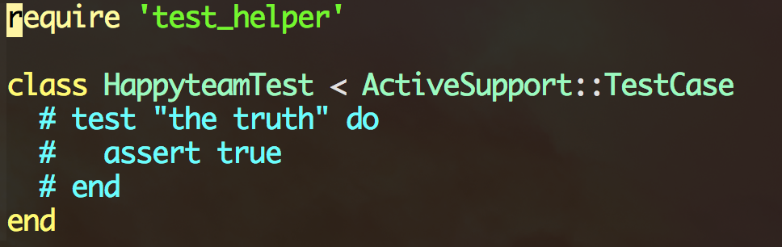

###为什么要为 Rails 程序编写测试？

测试是 Rails 程序的重要组成部分，不是处于尝鲜和好奇才编写测试。基本上每个 Rails 程序都要频繁和数据库交互，所以测试时也要和数据库交互。为了能够编写高效率的测试，必须要了解如何设置数据库以及导入示例数据。

### Rails 测试环境

默认情况下，Rails 程序有三个环境：开发环境，测试环境和生产环境。每个环境所需的数据库在 config/database.yml 文件中设置。

测试使用的数据库独立于其他环境，不会影响开发环境和生产环境的数据库。

---

###  如何编写测试代码？

下面我们会针对Model，Controller 分别介绍编写测试的目的以及如何编写高效实用的测试代码。

首先让我们来创建一个测试项目

	$ rails new railstest

执行 rails new 命令生成新程序时，Rails 会创建一个名为 test 的文件夹。这个文件夹中的文件如下：
	
	controllers    #存放控制器测试文件
	fixtures	   #存放示例数据
	integration	   #存放多个控制器之间交互的测试
	models		   #存放模型测试文件
	test_helper.rb #保存测试的默认设置
	helpers
	mailers
	

#### 为模型编写单元测试

下面让我们来创建一个model，同时也会在test/models 文件夹中生成单元测试文件

	$ rails g model happyteam coder:string
	
	  invoke    active_record
      create    db/migrate/20151009030310_create_happyteams.rb
      create    app/models/happyteam.rb
      invoke    test_unit
      create    test/models/happyteam_test.rb
      create    test/fixtures/happyteams.yml
      
我们看一下 test/models/happyteam_test.rb 中的内容

	require 'test_helper'

还记得我们在执行 rails new 命令时生成的 test_helper.rb 文件吗？ 它是测试的默认设置，所有的测试文件都会载入这个文件，因此在所有测试中都可使用其中定义的方法。

	test "the truth" do
		assert true
	end
	
和下面的代码是等效的

	def test_the_truth
  		assert true
	end

Rails 还提供了 test 方法，接受一个测试名作为参数，然后跟着一个代码块。test 方法会生成一个 MiniTest::Unit(ActiveSupport::TestCase 的父类) 测试，方法名以 test_ 开头。

	assert true

这行代码叫做“断言”。断言可以检查：

- 两个值是够相等；
- 对象是否为 nil；
- 这行代码是否抛出异常；
- 用户的密码长度是否超过 5 个字符；

每个测试中都有一个到多个断言。只有所有断言都返回真值，测试才能通过。

下面让我们运行一下测试，执行 rake test 命令。

	$ rake test test/models/happyteam_test.rb
	
		Run options: --seed 47256
		Running:
		.
		Finished in 0.012877s, 77.6578 runs/s, 77.6578 assertions/s.
		1 runs, 1 assertions, 0 failures, 0 errors, 0 skips

上述代码中的点号（.）表示一个通过的测试。如果测试失败，会看到一个 F。如果测试抛出异常，会看到一个 E。输出的最后一行是测试总结。	

下面我们再来写一个测试，编辑 happyteam_test.rb

	require 'test_helper'

	class HappyteamTest < ActiveSupport::TestCase
   		test "should not save happyteam without coder" do
     		happyteam = Happyteam.new
     		assert_not happyteam.save
   		end
	end
	
运行这个测试后，会显示一个更友好的断言失败消息：

	# Running:

	F

	Finished in 0.022786s, 43.8866 runs/s, 43.8866 assertions/s.

  	1) Failure:
	HappyteamTest#test_should_not_save_happyteam_without_coder [/railstest/test/models/happyteam_test.rb:	6]:
	Expected true to be nil or false

	1 runs, 1 assertions, 1 failures, 0 errors, 0 skips
	
如果想让这个测试通过，可以在模型中为 coder 字段添加一个数据验证：

	class Happyteam < ActiveRecord::Base
  		validates :coder, presence: true
	end

再次运行测试，测试应该是成功的

	# Running:

	.	

	Finished in 0.026992s, 37.0480 runs/s, 37.0480 assertions/s.

	1 runs, 1 assertions, 0 failures, 0 errors, 0 skips

你可能注意到了，我们首先编写一个检测所需功能的测试，这个测试会失败，然后编写代码，实现所需功能，最后再运行测试，确保测试可以通过。这一过程，在软件开发中称为“测试驱动开发”（Test-Driven Development，TDD）。

另外，断言是测试的核心，是真正用来检查功能是否符合预期的工具。Rails 提供了很多断言，详情请参阅[官方文档](http://guides.rubyonrails.org/testing.html)

#### 为控制器编写功能测试

在 Rails 中，测试控制器各动作需要编写功能测试，主要测试以下内容：

- 请求是否成功；
- 是否转向了正确的页面；
- 用户是否通过了身份认证；
- 是否把正确的对象传给了渲染响应的模板；
- 是否在视图中显示了相应的消息；

下面我们来创建一个控制器，并打开 test/controllers/

	$ rails generate controller happyteams index
	$ vi test/controllers/happyteams_controller_test.rb
	
在 test_should_get_index 测试中，Rails 模拟了一个 GET 请求 index action 的动作。GET 方法会发起请求，并把结果传入响应中。可接受 4 个参数：

- 所请求控制器的动作，可使用字符串或 Symbol；
- 可选的 Hash，指定传入动作的请求参数（例如，请求字符串参数或表单提交的参数）；
- 可选的 Hash，指定随请求一起传入的会话变量；
+ 可选的 Hash，指定 Flash 消息的值； 

比如，还可以这样写：

	get(:show, {'id' => "12"}, {'user_id' => 5})
或者：

	get(:view, {'id' => '12'}, nil, {'message' => 'booya!'})
	
如果熟悉 HTTP 协议就会知道，get 是请求的一种类型。在 Rails 功能测试中可以使用 6 种请求：

- get
- post
- patch
- put
- head
- delete

这几种请求都可作为方法调用，不过前两种最常用。

使用上述 6 种请求之一发起请求并经由控制器处理后，会产生 4 个 Hash 供使用：

- assigns：动作中创建在视图中使用的实例变量；
- cookies：设置的 cookie；
- flash：Flash 消息中的对象；
- session：会话中的对象；

和普通的 Hash 对象一样，可以使用字符串形式的键获取相应的值。除了 assigns 之外，另外三个 Hash 还可使用 Symbol 形式的键。

	flash["gordon"]               flash[:gordon]
	session["shmession"]          session[:shmession]
	cookies["are_good_for_u"]     cookies[:are_good_for_u]
	assigns["something"]
	

#### 集成测试

集成测试用来测试多个控制器之间的交互，一般用来测试程序中重要的工作流程。

与单元测试和功能测试不同，集成测试必须单独生成，保存在 test/integration 文件夹中。Rails 提供了一个生成器用来生成集成测试骨架.

	$ rails generate integration_test user_flows
	
集成测试继承自 ActionDispatch::IntegrationTest，因此可在测试中使用一些额外的帮助方法。在集成测试中还要自行引入固件，这样才能在测试中使用。

下面是个简单的集成测试，涉及多个控制器：

        require 'test_helper'

        class UserFlowsTest < ActionDispatch::IntegrationTest
          fixtures :users

          test "login and browse site" do
            # login via https
            https!
            get "/login"
            assert_response :success

            post_via_redirect "/login", username: users(:david).username, password: users(:david).password
            assert_equal '/welcome', path
            assert_equal 'Welcome david!', flash[:notice]

            https!(false)
            get "/posts/all"
            assert_response :success
            assert assigns(:products)
          end
        end
        
如上所述，集成测试涉及多个控制器，而且用到整个程序的各种组件，从数据库到调度程序都有。而且，在同一个测试中还可以创建多个会话实例，还可以使用断言方法创建一种强大的测试 DSL。