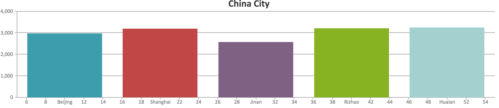
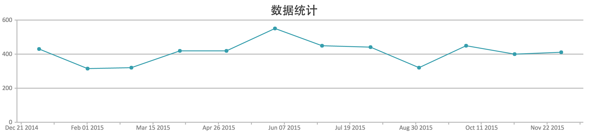
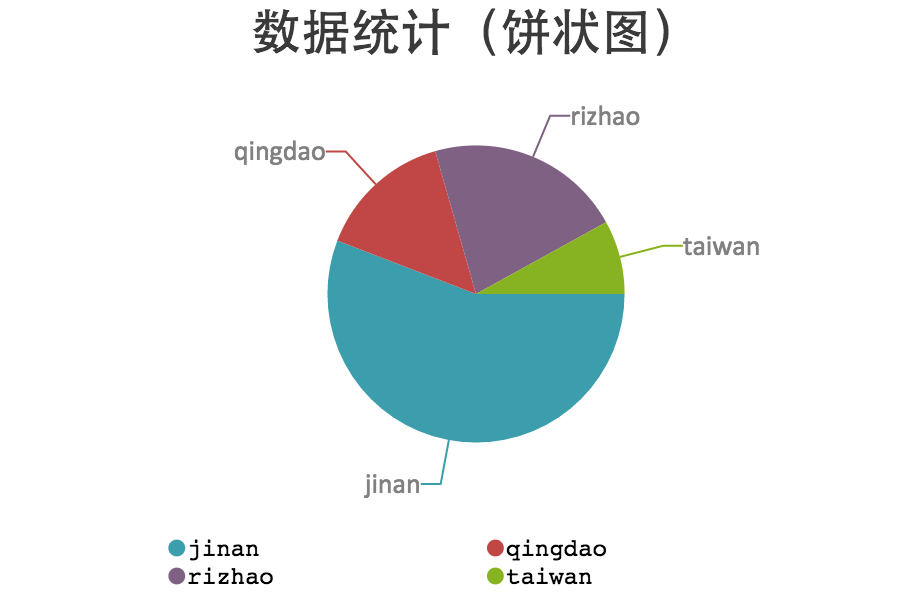
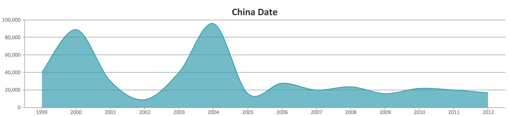

#统计图表（Chart）

&emsp;&emsp;统计图表的制作使用CanvasJS。

## 使用CanvasJS

### **下载[canvasjs.min.js](http://canvasjs.com/download-html5-charting-graphing-library)文件并添加到项目内**

### **举例使用**
**1.柱状图**

```
<!DOCTYPE HTML>
<html>
<head>
<script type="text/javascript">
window.onload = function () {
  var chart = new CanvasJS.Chart("chartContainer",
      {
title:{
text: "China City"
},
data: [
{dataPoints: [
{ x: 10, y: 2971, label: "Beijing"},
{ x: 20, y: 3200,  label: "Shanghai"},
{ x: 30, y: 2580,  label: "Jinan"},
{ x: 40, y: 3221,  label: "Rizhao"},
{ x: 50, y: 3244,  label: "Huaian"}]}]
});
chart.render();
}
</script>
<script type="text/javascript" src="/assets/javascript/canvasjs.min.js"></script></head>
<body>
<div id="chartContainer" style="height: 200px; width: 50%;">
</div>
</body>
</html>
```


**2.线形图**

```
<!DOCTYPE HTML>
<html>
<head>
<script type="text/javascript">
  window.onload = function () {
    var chart = new CanvasJS.Chart("chartContainer",
        {
title:{
text: "数据统计"
},
data: [
{
type: "line",
{ x: new Date(2015, 00, 1), y: 430 },
{ x: new Date(2015, 01, 1), y: 314 },
{ x: new Date(2015, 02, 1), y: 320 },
{ x: new Date(2015, 03, 1), y: 420 },
{ x: new Date(2015, 04, 1), y: 420 },
{ x: new Date(2015, 05, 1), y: 550 },
{ x: new Date(2015, 06, 1), y: 450 },
{ x: new Date(2015, 07, 1), y: 440 },
{ x: new Date(2015, 08, 1), y: 320 },
{ x: new Date(2015, 09, 1), y: 450 },
{ x: new Date(2015, 10, 1), y: 400 },
{ x: new Date(2015, 11, 1), y: 410 }]}]
});
chart.render();
}
</script>
<script type="text/javascript" src="/assets/javascript/canvasjs.min.js"></script></head>
<body>
<div id="chartContainer" style="height: 200px; width: 50%;">
</div>
</body>
</html>
```



**3.饼状图**

```
<!DOCTYPE HTML>
<html>
<head>
<script type="text/javascript">
  window.onload = function () {
    var chart = new CanvasJS.Chart("chartContainer",
        {
title:{
text: "数据统计（饼状图）"
},
legend: {
maxWidth: 450,
itemWidth: 150
},
data: [
{
type: "pie",
showInLegend: true,
legendText: "{indexLabel}",
dataPoints: [
{ y: 81563, indexLabel: "jinan" },
{ y: 21498, indexLabel: "qingdao" },
{ y: 31258, indexLabel: "rizhao" },
{ y: 11721, indexLabel: "taiwan"},
]
}
]
});
chart.render();
}
</script>
<script type="text/javascript" src="/assets/javascript/canvasjs.min.js"></script></head>
<body>
<div id="chartContainer" style="height: 200px; width: 50%;">
</div>
</body>
</html>
```


4.样条曲线图

```
<!DOCTYPE HTML>
<html>
<head>
<script type="text/javascript">
  window.onload = function () {
    var chart = new CanvasJS.Chart("chartContainer",
        {
title:{
text: "China Date"
},
data: [
{
type: "splineArea",
dataPoints: [
{x: new Date(1999,0), y: 40000},
{x: new Date(2000,0), y: 89000},
{x: new Date(2001,0), y: 30000},
{x: new Date(2002,0), y: 09000},
{x: new Date(2003,0), y: 40000},
{x: new Date(2004,0), y: 96000},
{x: new Date(2005,0), y: 16130},
{x: new Date(2006,0), y: 28000},
{x: new Date(2007,0), y: 20000},
{x: new Date(2008,0), y: 23900},
{x: new Date(2009,0), y: 16130},
{x: new Date(2010,0), y: 22000},
{x: new Date(2011,0), y: 20000},
{x: new Date(2012,0), y: 17000}
]
}
]
});
chart.render();
}
</script>
<script type="text/javascript" src="/assets/javascript/canvasjs.min.js"></script></head>
<body>
<div id="chartContainer" style="height: 200px; width: 50%;">
</div>
</body>
</html>
```


