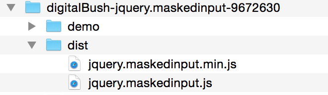
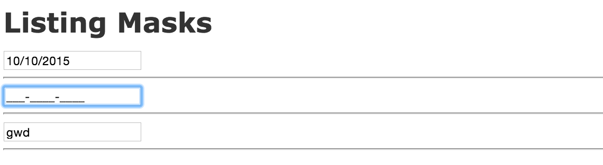

####Masked input 

masked input 是一个可以限定文本框输入内容 jQuery 插件。

比如：

- 日期格式就应该这样写： 10/10/2015
- 手机格式应该这样写(国内)：188-8888-8888
- 昵称只能是字母：aaaa

####如何使用

1. 首先我们需要在我们的Rails项目中添加 jquery-ui gem. 打开项目的 Gemfile 文件，添加如下代码.

		$ gem 'jquery-ui-rails','5.0.5'
	
	添加之后运行：

		$ bundle install
	
2. 然后下载 masked input 插件. 两种下载途径，从 [Github](https://github.com/digitalBush/jquery.maskedinput) 下载或从 jQuery [官网](https://plugins.jquery.com/maskedinput/)下载.

3. 下载之后将 dist/jquery.maskedinput.min.js 文件 copy 到你项目中的 app/assets/javascripts/ 目录下.

	

		app/
			assets/
				images/
				javascripts/
					application.js
					maskedinput.js
					masks.coffee
				stylesheets/
			
4. 打开 views 中的视图文件，写入如下代码：
	
		<h1>Listing Masks</h1>
		<%= text_field_tag :just_date %>
		

		<%= text_field_tag :just_phone %>
		

		<%= text_field_tag :just_alpha %>
		

		
		
	效果如图所示：
	
	
	
5. enjoy it !